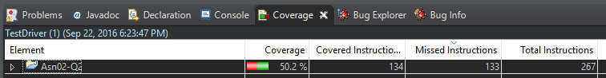
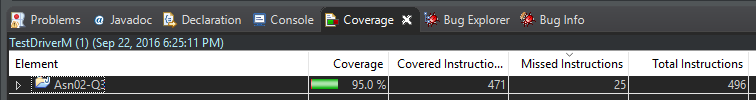

# 3

## a

Initial code coverage was 50.2%.

## b

Final code coverage was 95%. The remaining 5% are try/catch exceptions that don't occur during normal operation, and variable declarations without assignment.

